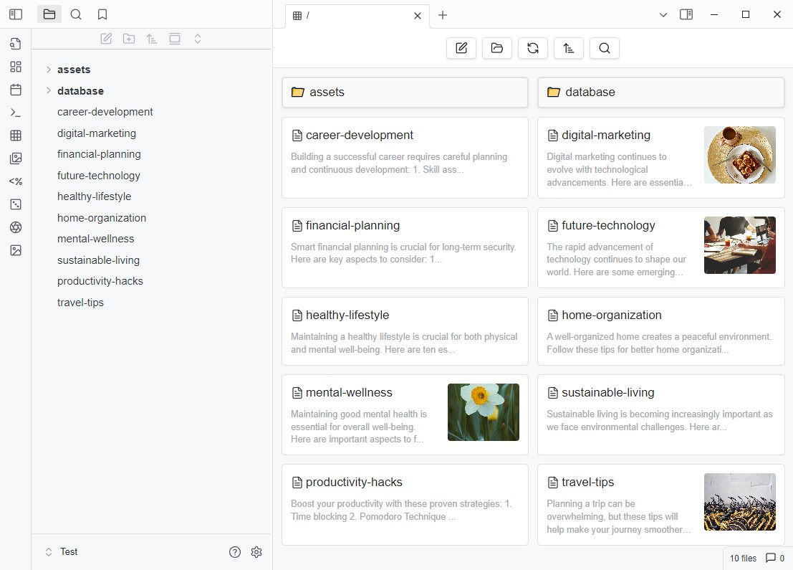

# GridExplorer

English | [日本語](README_ja.md) | [中文](README_zhTW.md)

This is a grid view plugin designed for Obsidian, aimed at providing a more intuitive way to browse and manage your notes and folders.




## Features

- **Grid View**: Displays your notes and folders in a grid format for quick browsing.
- **Folder Mode**: Shows notes in a folder structure, supporting entry into subfolders.
- **Bookmark Mode**: Allows quick access to notes in your bookmarks.
- **Search Results Mode**: Displays Obsidian's search results.
- **Custom Sorting**: Supports various sorting methods, including by name, modification time, and random sorting.
- **Settings Options**: Allows customization of grid item width and default sorting method.
- **Multilingual Support**: Currently supports English, Traditional Chinese,  Simplified Chinese, and Japanese.

## Installation

1. Download the plugin and place it in the Obsidian plugins folder.
2. Enable this plugin in Obsidian.

## Usage

- Click the grid icon in the toolbar to open the grid view.
- Use the right-click menu to select "Open in Grid View" on a folder.
- Use command to view the current note in the grid view (If there is no active note currently, open the root directory).
- In the grid view, you can click on notes to open them or click on folders to enter them.

## Folder Notes

Create a folder note by using the right-click menu on a folder. After creation, you'll see an icon on the folder, and you can set the folder's sorting method in the note's Metadata.

```
---
sort: name-desc
color: red
---
```

Available sorting methods:

- name-asc
- name-desc
- mtime-desc
- mtime-asc
- ctime-desc
- ctime-asc
- random

Available colors:

- red
- orange
- yellow
- green
- cyan
- blue
- purple
- pink

## Settings

In the plugin's settings page, you can:

- Set folders to ignore.
- Choose the default sorting method.
- Adjust the width, height, and other appearance settings of grid items.
- Set whether to display images and videos.
- Configure various display mode toggles.
- Set whether to reuse an existing grid view and the opening position of the grid view.

## Contribution

If you have any suggestions or encounter issues, feel free to raise issues or submit pull requests.

## License

This plugin follows the [MIT License](LICENSE).