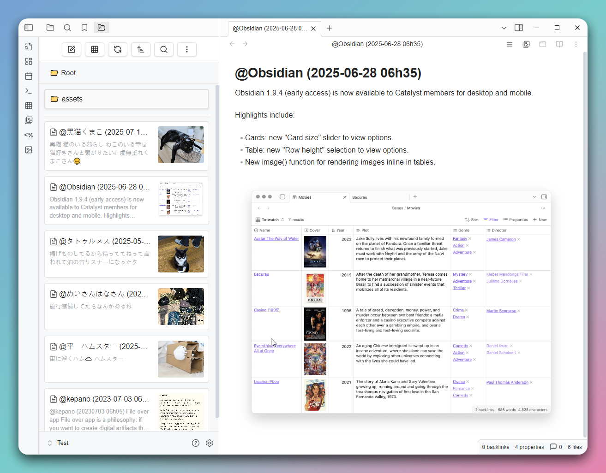

# GridExplorer

English | [日本語](README_ja.md) | [中文](README_zhTW.md)

This is a grid view plugin designed for Obsidian, aimed at providing a more intuitive way to browse and manage your notes and folders.




## Features

- **Grid View**: Displays your notes and folders in a grid format for quick browsing.
- **Folder Mode**: Shows notes in a folder structure, supporting entry into subfolders.
- **Bookmark Mode**: Allows quick access to notes in your bookmarks.
- **Search Results Mode**: Displays Obsidian's search results.
- **Backlinks Mode**: Shows notes that link to the current note.
- **Outgoing Links Mode**: Shows outgoing links from the current note, including media files.
- **All Files Mode**: Lists all files in the vault.
- **Recent Files Mode**: Lists the n most recently modified files.
- **Random Files Mode**: Randomly lists n files.
- **Custom Mode**: Customize the displayed file content using Dataview query syntax.
- **Custom Sorting**: Supports various sorting methods, including by name, modification time, random sorting, and per-folder custom sorting.
- **Settings Options**: Allows customization of grid item width and default sorting method.
- **Multilingual Support**: Currently supports English, Traditional Chinese, Simplified Chinese, and Japanese.

## Installation

Find "GridExplorer" in the Community plugins through the Obsidian app.

## Usage

- Click the grid icon in the toolbar to open the grid view.
- Use the right-click menu to select "Open in Grid View" on a folder.
- Use command to view the current note in the grid view (If there is no active note currently, open the root directory).
- In the grid view, you can click on notes to open them or click on folders to enter them.

## Supported File Formats

### Image Formats
- `jpg` / `jpeg`
- `png`
- `gif`
- `webp`
- `avif`
- `bmp`
- `svg`

### Video Formats
- `mp4`
- `webm`
- `mov`
- `avi`
- `mkv`
- `ogv`

### Audio Formats
- `flac`
- `m4a`
- `mp3`
- `ogg`
- `wav`
- `3gp`

### Document Formats
- `md` (Markdown)
- `pdf`
- `canvas`
- `base`

## Folder Notes

Create a folder note by using the right-click menu on a folder. After creation, you'll see an icon on the folder, and you can set the folder's sorting method in the note's Metadata.

```
---
sort: name-desc
color: red
---
```

Available sorting methods:

- name-asc
- name-desc
- mtime-desc
- mtime-asc
- ctime-desc
- ctime-asc
- random

Available colors:

- red
- orange
- yellow
- green
- cyan
- blue
- purple
- pink

CSS Class: `.ge-grid-item.ge-foldernote`

## Contribution

If you have any suggestions or encounter issues, feel free to raise issues or submit pull requests.

## License

This plugin follows the [MIT License](LICENSE).