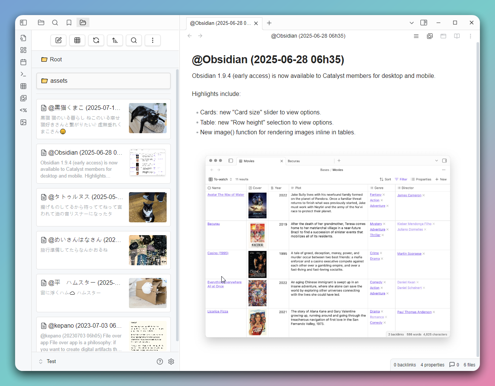
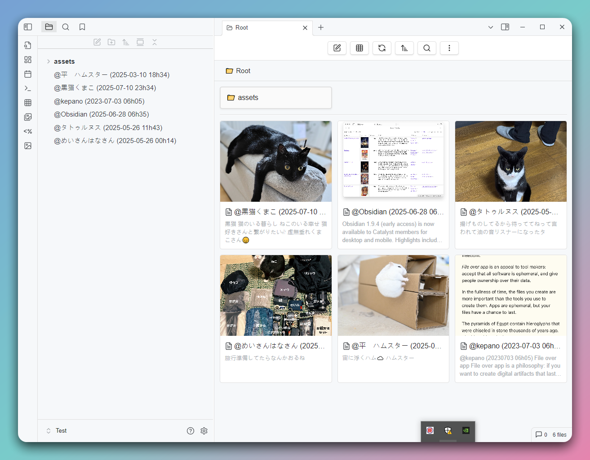

# GridExplorer

[English](README.md) | 日本語 | [中文](README_zhTW.md)

これは Obsidian 用のグリッドビュープラグインで、ノートやフォルダをより直感的に閲覧・管理するための方法を提供することを目的としています。




## 機能

- **グリッドビュー**：ノートやフォルダをグリッド形式で表示し、素早く閲覧できます。
- **フォルダモード**：フォルダ構造でノートを表示し、サブフォルダへの移動をサポートします。
- **ブックマークモード**：ブックマークに登録したノートへ素早くアクセスできます。
- **検索結果モード**：Obsidian の検索結果を表示します。
- **バックリンクモード**：現在のノートへのバックリンクを持つノートを表示します。
- **アウトゴーイングリンクモード**：現在のノートからの外部リンク（メディアファイル含む）を表示します。
- **全ファイルモード**：ボールト内の全ファイルを一覧表示します。
- **最近ファイルモード**：最近変更された n 個のファイルを表示します。
- **ランダムファイルモード**：ランダムに n 個のファイルを表示します。
- **カスタムモード**：Dataview クエリ構文を使用して表示するファイルの内容をカスタマイズできます。
- **カスタムソート**：名前、更新日時、作成日時、ランダムソートなど、様々な並べ替え方法やフォルダごとのカスタムソートをサポートします。
- **設定オプション**：グリッドアイテムの幅やデフォルトの並べ替え方法をカスタマイズできます。
- **多言語サポート**：現在、英語、繁体字中国語、簡体字中国語、日本語をサポートしています。

## インストール

Obsidian アプリのコミュニティプラグインから「GridExplorer」を検索してインストールしてください。

## 使用方法

- ツールバーのグリッドアイコンをクリックしてグリッドビューを開きます。
- フォルダを右クリックして「グリッドビューで開く」を選択します。
- コマンドを使用して、グリッドビューで現在のノートを表示できます（現在のノートがない場合は、ルートディレクトリを開きます）。
- グリッドビューでは、ノートをクリックして開いたり、フォルダをクリックして中に入ったりすることができます。

## サポートされているファイル形式

### 画像形式
- `jpg` / `jpeg`
- `png`
- `gif`
- `webp`
- `avif`
- `bmp`
- `svg`

### 動画形式
- `mp4`
- `webm`
- `mov`
- `avi`
- `mkv`
- `ogv`

### 音声形式
- `flac`
- `m4a`
- `mp3`
- `ogg`
- `wav`
- `3gp`

### ドキュメント形式
- `md` (Markdown)
- `pdf`
- `canvas`
- `base`

## フォルダノート

フォルダを右クリックしてフォルダノートを作成できます。作成後、フォルダにアイコンが表示され、ノートのメタデータでフォルダの並べ替え方法を設定できます。

```
---
sort: name-desc
color: red
---
```

利用可能な並べ替え方法：

- name-asc
- name-desc
- mtime-desc
- mtime-asc
- ctime-desc
- ctime-asc
- random

使える色:

- red
- orange
- yellow
- green
- cyan
- blue
- purple
- pink

CSS Class： `.ge-grid-item.ge-foldernote`

## 貢献

提案や問題がある場合は、イシューの作成やプルリクエストの提出をお願いします。

## ライセンス

このプラグインは [MIT License](LICENSE) に従います。
