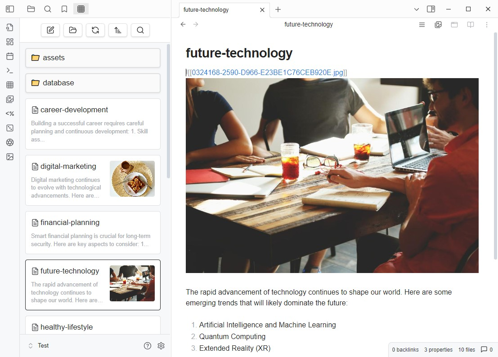

# GridExplorer

[English](README.md) | [日本語](README_ja.md) | 中文

這是一個為 Obsidian 設計的網格視圖插件，旨在提供更直觀的方式來瀏覽和管理您的筆記和資料夾。




## 功能

- **網格視圖**：以網格形式顯示您的筆記和資料夾，方便快速瀏覽。
- **資料夾模式**：以資料夾結構顯示筆記，支持進入子資料夾。
- **書籤模式**：訪問書籤中的筆記。
- **搜尋結果模式**：顯示 Obsidian 的搜尋結果。
- **反向連結模式**：顯示當前筆記的反向連結筆記。
- **外部連結模式**：顯示當前筆記的外部連結，包含媒體檔案。
- **所有檔案模式**：列出整個儲存庫內的所有檔案。
- **最近檔案模式**：列出最近修改的n個檔案。
- **隨機檔案模式**：隨機列出n個檔案。
- **自定義排序**：支援多種排序方式，包括名稱、修改時間和隨機排序，也可自訂個別資料夾的排序方式。
- **設定選項**：可以自定義網格項目的寬度和預設排序方式。
- **多語言支持**：目前支持英文、繁體中文、簡體中文和日文。

## 安裝

透過 Obsidian 應用程式在社群外掛程式中尋找「GridExplorer」。

## 使用方法

- 點擊工具列中的網格圖標以開啟網格視圖。
- 使用右鍵菜單可以在資料夾上選擇「在網格視圖中開啟」。
- 使用命令可以在網格視圖中查看當前筆記（如果沒有當前筆記，則打開根目錄）。
- 在網格視圖中，您可以點擊筆記以打開它們，或點擊資料夾以進入。

## 資料夾筆記

在資料夾上按右鍵選單建立資料夾筆記，建立後可以在資料夾上看到icon，並且在筆記內的 Metadata 設定資料夾的排序方式

```
---
sort: name-desc
color: red
---
```

可使用的排序方式為:

- name-asc
- name-desc
- mtime-desc
- mtime-asc
- ctime-desc
- ctime-asc
- random

可以用的顏色為：

- red
- orange
- yellow
- green
- cyan
- blue
- purple
- pink


CSS Class： `.ge-grid-item.ge-foldernote`


## 設定

在插件的設定頁面中，您可以：

- 設定要忽略的資料夾。
- 選擇預設的排序方式。
- 調整網格項目的寬度高度等外觀設定。
- 設定是否顯示圖片和影片
- 設定各種顯示模式的開關
- 設定是否重複使用已開啟的網格視圖及網格視圖的開啟位置

## 貢獻

如果您有任何建議或發現問題，歡迎提出問題或提交拉取請求。

## 授權

此插件遵循 [MIT License](LICENSE)。